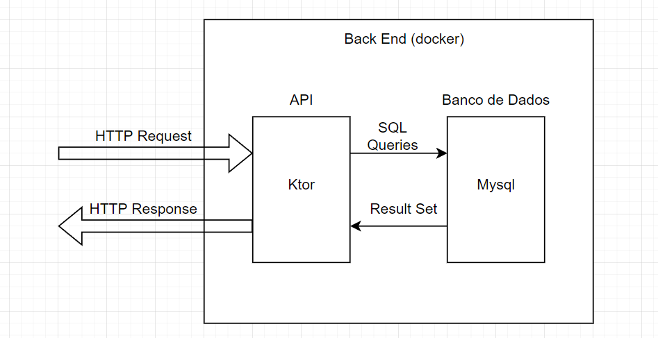
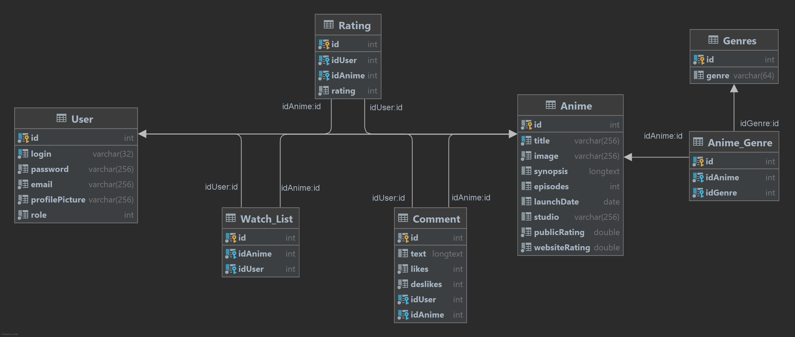
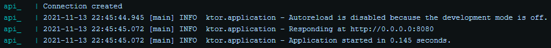

# Back End do Anime Hub

## Desenvolvedores

| Nome | RA | Lab | Cargo |
| --- | --- | :---: | --- |
| [Bruno Vilardi Bueno](https://github.com/Brvilardi) | 19.00331-5 | 1 | Back End |
| [Martin Ropke](https://github.com/MartinRopke) | 19.01592-5 | 1 | Back End |
| [Gabriel Marques Rangel da Silva](https://github.com/Rangel07) | 19.01288-8 | 1 | Front End |
| [Arthur Torres Barros](https://github.com/CyberGoat9152) | 17.01913-3 | 3 | Front End |

## Overview do Projeto
Repositório do Back End do projeto Anime Hub.

Esse projeto foi feito para a disciplina ECM251-Linguagens de Programação I.

A proposta do trabalho é criar um aplicativo WEB (Mobile First) de avaliação de Animes, inspirado no [MyAnimeList](https://myanimelist.net/).

Para desenvolver o Aplicativo, nosso grupo se dividiu em 2 equipes:
- Back End (esse repositório)
- Front End ([link do repo](https://github.com/AnimeHub-ECM251/frontEnd))

## Arquitetura
O Back End desse trabalho tem como objetivo criar uma API para que o Front End consiga interagir facilmente com um Banco de Dados.

Para isso, criaremos a camada da API utilizando o Framework [Ktor](https://ktor.io/) e o banco de dados [Mysql](https://www.mysql.com/)

Os modelos usados para definição do Banco de Dados são:

# Como Rodar a API

### Clonar o repositório
    git clone https://github.com/AnimeHub-ECM251/backEnd

### Buildar as imagens
    docker-compose build

Esse comando irá buildar uma imagem do Banco de Dados e uma imagem para API (checar o arquivo [docker-compose.yml](https://github.com/AnimeHub-ECM251/backEnd/blob/main/docker-compose.yml) para mais detalhes)

*OBS: É possível que demore alguns minutos para buildar a imagem da API, já que várias dependencias específicadas no [pom.xml](https://github.com/AnimeHub-ECM251/backEnd/blob/main/pom.xml) precisarão ser baixadas da internet.*

## Rodar o container
    docker-compose up
Esse comando irá criar 2 containers utilizando as imagens buildadas no comando anterior (Banco de Dados e API).

Como a API precisa criar uma conexão com o banco de dados, é possível que aparecam algumas mensagens de erro.

Geralmente o Banco de Dados termina a inicialização dentro de poucos minutos e, então, a API conseguira se conectar.

*OBS: A API tenta repetidamente se conectar com o Banco de Dados, logo basta aguardar que o container da API exiba que o servidor foi iniciado*

Após a inicialização da API, deve-se ter algo parecido com:

# Uso da API

A partir de agora a API deve estar disponível na porta 8080 da máquina local. Para testar, basta entrar usando qualquer navegador em [http://localhost:8080](http://localhost:8080/).

Uma mensagem de Boas Vindas deve ter aparecido como resposta no Navegador:

As rotas/funcionabilidades da API podem ser observadas na documentação abaixo.

# Documentação da API
*Documentação criada no [Postman](https://www.postman.com/) e gerada com [docgen](https://github.com/thedevsaddam/docgen)*

A documentação desta API pode ser observada via:
- Arquivo HTML ([link](https://htmlpreview.github.io/?https://github.com/AnimeHub-ECM251/backEnd/blob/main/docs/index.html))
- Postman Documenter ([link](https://documenter.getpostman.com/view/16858667/UVC8Cm7Y))

